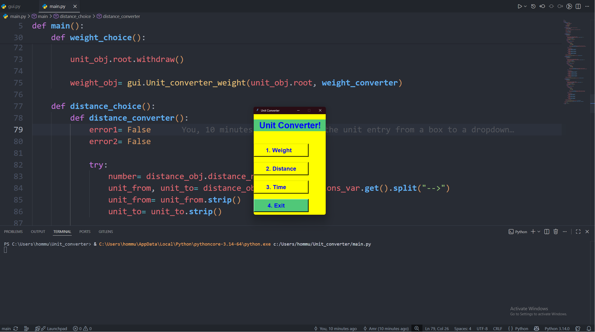

# Unit Converter

A desktop application developed in **Python** using the **Tkinter** library that allows users to convert between different units of **Weight**, **Distance**, and **Time** through a simple and user-friendly graphical interface.

---

## Features

- Convert between different **Weight** units:
  - Kilogram (kg)
  - Gram (g)
  - Milligram (mg)

- Convert between different **Distance** units:
  - Kilometer (km)
  - Meter (m)
  - Centimeter (cm)

- Convert between different **Time** units:
  - Hour (hr)
  - Minute (min)
  - Second (sec)

- Supports both integer and decimal numbers.
- Input validation for incorrect or negative values.
- Error messages for invalid inputs.
- Separate result and error windows.
- Easy-to-use graphical interface.

---

## Screenshot

> *(pass)*



---

## Project Structure

```
Unit_Converter/
│
├── main.py        # Program logic and calculations
├── gui.py         # Graphical User Interface
└── README.md
```

---

## How to Run

1. Make sure Python 3 is installed.
2. Download or clone the project.
3. Open the project folder.
4. Run the following command:

```bash
python main.py
```

---

## How to Use

1. Launch the application.
2. Choose one of the available converters:
   - Weight
   - Distance
   - Time
3. Enter the value you want to convert.
4. Select the conversion type from the drop-down menu.
5. Click the **Convert** button.
6. The converted value will be displayed in a separate result window.

---

## Input Validation

The program checks that:

- A conversion option has been selected.
- The entered value is a valid number.
- The value is greater than or equal to zero.

If any of these conditions are not met, an appropriate error message is displayed.

---

## Technologies Used

- Python 3
- Tkinter
- Object-Oriented Programming (OOP)

---

## Programming Concepts Used

This project demonstrates the use of:

- Classes and Objects
- Functions
- Event-driven programming
- Callback functions
- Tkinter widgets
- `Toplevel` windows
- `StringVar`
- Dictionaries
- Exception handling (`try` / `except`)
- Input validation
- Separation of GUI and program logic

---

## Future Improvements

Possible future enhancements include:

- Temperature converter
- Volume converter
- Currency converter
- More measurement units
- Conversion history
- Dark mode
- Save previous conversions

---

## Author

**Amr Deyab**

---

## License

This project was created for educational purposes.
